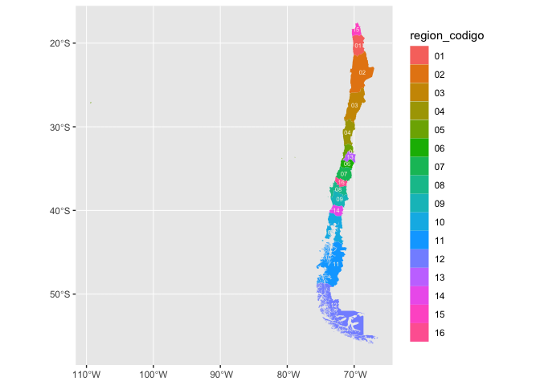

<!-- README.md is generated from README.Rmd. Please edit that file -->

# ggchile

<!-- badges: start -->

<!-- badges: end -->

The goal of ggchile is to …

## Installation

You can install the development version of ggchile from
[GitHub](https://github.com/) with:

``` r
# install.packages("devtools")
devtools::install_github("EvaMaeRey/ggchile")
```

## Example

This is a basic example which shows you how to solve a common problem:

``` r
library(ggchile)
## basic example code
```

What is special about using `README.Rmd` instead of just `README.md`?
You can include R chunks like so:

``` r
library(ggplot2)
ggplot() +
  stamp_sf_regionchile(data = cars)
```


``` r

library(ggplot2)
chile_region_flat %>%
ggplot() +
aes(region_codigo = region_codigo) +
geom_sf_regionchile()
#> Joining with `by = join_by(region_codigo)`
```


``` r

chile_region_flat %>%
ggplot() +
aes(region_codigo = region_codigo, fill = region_codigo,
    label = region_codigo) +
geom_sf_regionchile(linewidth = 0) +
geom_label_chile_region(lineheight = .7,
size = 2, check_overlap= TRUE,
color = "oldlace")
#> Joining with `by = join_by(region_codigo)`
#> Joining with `by = join_by(region_codigo)`
```


